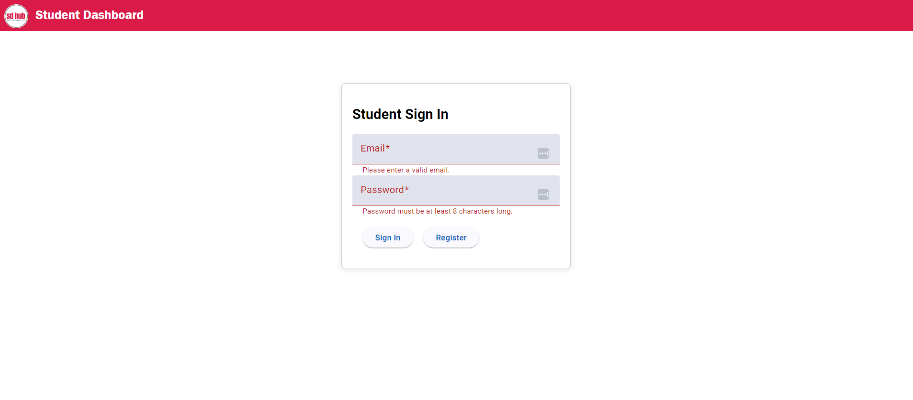
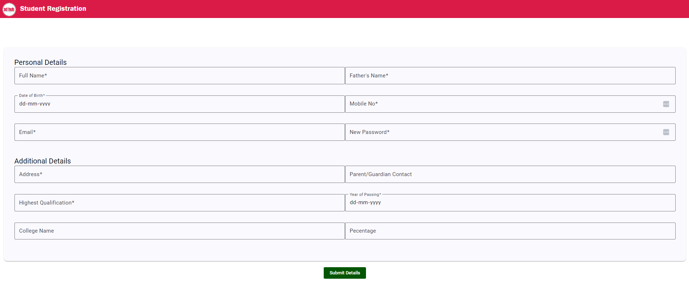

Institute Management application

Number of Roles : 5 
Student, Trainer, Stakeholder, Admin and staff(FOE) 

Dashboard: 
Dynamic dashboard would be needed which would be viewed by the stakeholders. 

Tables: 
Asian would be viewed by admin and would need dynamic tables where sorting and filtering will be done a lot 
CSV and PDF download of the data would be done. 

This application would contain the following modules :

Registration module 
In this module they would be three steps 
Registration, examination and final selection of student.
In this module every student should be able to get a unique ID and this ID should be email to the student as well 
A small entrance examination will be held 
The once passing will go for the next round where admin will finally selected students 
Trainer module: In this module trainer will be added with all details
Batch module : Batches would be created by the admin and assign to the trainer 
Attendance module: 
Daily attendance would be carried out with by the trainer of the students 
This attendance model would also consist of attendance of the employees of the
Certification module 
Final assessment a certificate should be automatically generated with students details 
Assessment module: 
Assessments would be created and data with assessments and students would be gathered 
Job status module: 
The front office executive would be checking with the job status of the students who have passed from our Institute and update this as well 
Syllabus Tracking module: 
In this module bi-weekly syllabus would be given by the trainer and tracking of this bi-weekly module would be the done by the trainer itself and admin would be monitoring it, in this module they would be attendance total number of students present in a class number of students absent and if the have any strong reason which classroom was this trainer taking the class, and the date on which class was taken 

